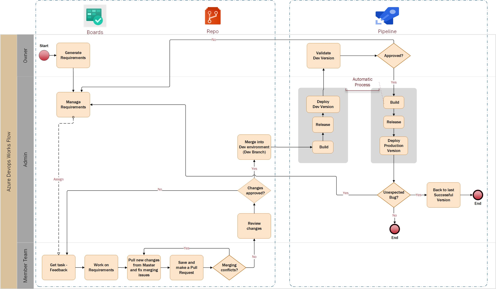

# AzureDevops-Workflow
A complete tutorial for implement Azure Devops in any project

## 1. Summary
## 2. Basics
   - Git
   - Azure DevOps
     - Boards, Repos, Pipelines, Test Plans
## 3. Workflow

## 4. Policies
   - Managing  branches (ramas por requerimiento,etc)
   - Pull requests policies (borrar una rama automaticamente una vez creada, etc)
    
## 5. Feedback

