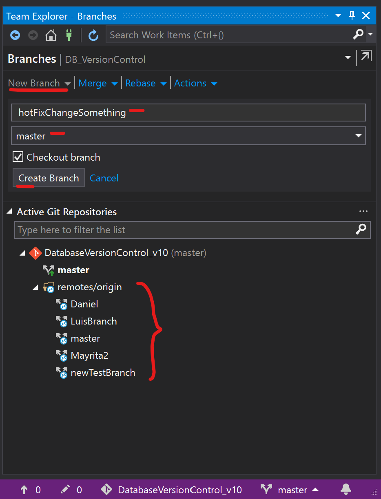
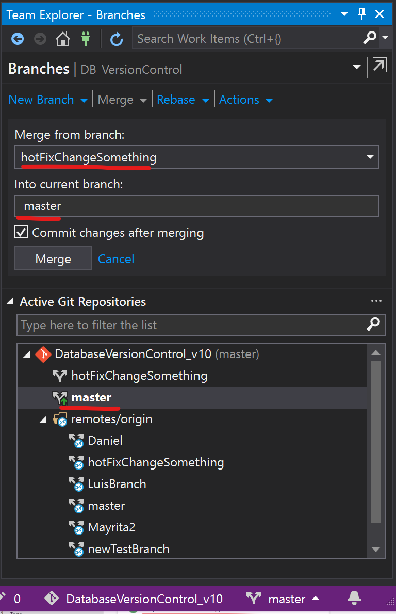

# Azure Devops - Work flow

## 1. Summary

This document involve aspects of two technologies (Azure Devops and Git) to provide assitance in the manage of projects since manage requeriments and tasks until deployment and producction.

## 2. Basics
- Azure DevOps
   - Boards, Repos, Pipelines, Test Plans
- Git
   
## 3. Work flow
### General Workflow

#### Member team step by step:
0. Initial tasks, Clone the project in visual studio (Do this every time an Azure Repository is created)
   This will create a copy of the Master Branch in the Azure Repository to the local environment

- Go to https://dev.azure.com/v-oshere/ , repository section (), click in clone options and then click in clone in Visual Studio option
  
   

- Visual Studio will be opened, then click in the prompt to confirm the connection
  
  

- Then will see the home dasboard for visual studio, in the left side is the Solution Explorer where We can find all files related to work, in the right side is the Team Explorer where We can be sync with the Azure Repository, by default when a repository is cloned it will be in the "master" branch as We can see in the right-bottom in the image below.
  
   

1. Update local master branch (Pull)

   If is the first time you clone a repository it is already updated, files in the local environment are the same than the Azure Repository.

   If not, every time a task is started the local master branch should be updated, to do that go to sync option in the Team Explorer view

   

   Then click en fetch, it will show all changes has been done in the Azure Repository for other users which are not currently in your local master branch
   

   To merge this changes to your local master branch click in Pull

2. Create new branch

   A new branch should be created when a new task is assigned, to do that go to Branches in the Team Explorer view
   

   The next image shows the Branches details, all branches available are showed in the Active Git Repositories section, in this project only exists the master branch in the local environment and in the remote (Azure Repository) there are some other created by another partners including the master branch which is the production branch by default.

   To create a new local branch click in New Branch, write a descriptive name for the branch ("hotFixChangeSomething" in the image), it will be created from the master local branch, it means it will be an independent copy, then click in Create Branch

   

   The next image shows the new branch created, by default when a branch is created it will be active, to identity and change the current active branch in the local repository go to the right-bottom corner in the visual studio window, the process to change between branches is called "checkout" and to do a checkout first is needed save and confirm (commit) all changes, if some changes are not commited it will be moved when you make a checkout

   

3. Save changes in the local repository (Commit)

   In the image below, in the Solution Explorer view a new exampleFileAdded.txt file was added to simulate the work done

   

   Once the task has been done and tested it is time to save the changes (Commit); commiting your changes is important because it allows track every change and easily back in the time, to do that first click in the save button in visual studio () then go to changes section in the Team Explorer and click en Changes

   

   Then write a commit message, it should describes all important features related to task done, then click in Commit All, it will save the changes in the git internal system
   

   When a commit is successful changes in the list should disapear, also a message of created commit and a sign to Sync your changes with the server appear, that is because the work is safe but only in the local repository.

   

4. Upload changes to the remote repository (Push) 

   Once the task branch is commited, it is time to upload (Sync) this commit to the Azure Repository (remote repository), go to Team Explorer and click in Sync
   

   The Outgoing Commits section shows some details of the changes as author, the commit message and when was commited, then click in Push
   

   The image below shows a successful push, it means that a remote branch named "hotFixChangeSomehing" was created in the remote repository as well
   

   

5. Send a request to admin to merge your changes into production (Pull Request)

   By business policies it is not posible push the changes directly to the remote master branch, it is necesary to send a request to the admin, the admin will decide based in your work done if the request is approved or rejected, this process is called Pull Request.

   To make a Pull Request go back in the Team Explorer and click in "Pull Request"

   

   Then click in New Pull Request, this will redirection to the Azure DevOps site on the Pull Request section, there there are some field to fill in:

- Title: By default is the commit name, it can change as nedeed
- Description: By default is the commit name, as a good practice write some relevant description to let the admin know which changes were done
- Reviewers: The person who approved or reject the pull request, It appears empty by default but already exists at least an admin, the most of cases it should be left empty
- Work item to link: The task in Azure DevOps which is related
- Tags:  Some key words to describe what involves the commit

   Click in Create

   

   After that, details of the sent pull request will be showed

-  Commit's title, from what branch it comes from and destination (the most of cases master branch)
- Name of the reviewer (The admin configured by default)
- Commit's description
- Discussion section if it is necessary other details before approve the pull request
- Approve Button: Admin is the only one person who is able to approve the PR, approve it by yourself is optional
- Complete PR: Define if once the PR is approved by the admin it should merge to production (Set auto-complete by default)
   

   

   Once the admin was reviewed the changes and there are not merging conflicts these changes will be part of the master branch (Production environment)

   

   Now the work for the task assigned is at least in three sites: in the local branch as "hotFixChangeSomething", in the remote branch as "hotFixChangeSomething" and in the master branch as a commit.

   It is time to prepare the local repository for the nexts tasks and it is nedeed to update the master branch with the last changes, to do that there are two ways:

- Update from remote repository (step1-Recommended), to keep updated any local branch from their related remote branch go to Branches section in the team explorer and double click in the branch you want to be placed (master in this case), then back to sync section in the team explorer:
  
  - Fetch: To show commits (changes) done in remote branch
  - Pull: To merge these commits to the current local branch

- In you local repository there are the master branch and the hotFixChageSomething branch, the second one has changes that has not the first one, to update the master branch go to Branches section in the team explorer and double click in master to place there, then go to merge button, here you need to add the Merge from branch

   

   Then click in Merge, now the master local branch is updated with the last changes from other branch, do the same exercise to merge from any local branch.
   

## 4. Policies and good practices
   - Managing  branches (branches by requirement,etc)
   - Pull requests policies (delete automatically a branch once its created, etc)
    

