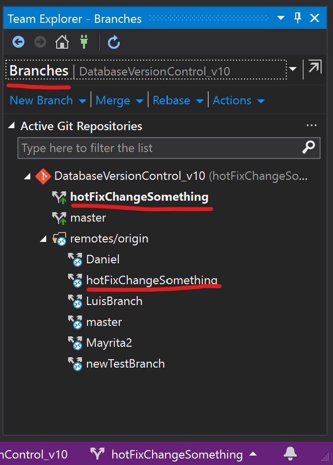

# AzureDevops-Workflow
A complete tutorial for implement Azure Devops in any project

## 1. Summary

## 2. Basics
   - Git
   - Azure DevOps
     - Boards, Repos, Pipelines, Test Plans
## 3. Workflow
### General Workflow

0. Initial tasks, Clone the project in visual studio (Do this every time an Azure Repository is created)
   This will create a copy of the Master Branch in the Azure Repository to the local environment

- Go to https://dev.azure.com/v-oshere/ , repository section (), click in clone options and then click in clone in Visual Studio option
   

- Visual Studio will be opened, then click in the prompt to confirm the connection
  

- Then will see the home dasboard for visual studio, in the left side is the Solution Explorer where We can find all files related to work, in the right side is the Team Explorer where We can be sync with the Azure Repository, by default when a repository is cloned it will be in the "master" branch as We can see in the right-bottom in the image below.

1. Update local master branch

If is the first time you clone a repository it is already updated, files in the local environment are the same than the Azure Repository.
If not, every time a task is started the local master branch should be updated, to do that go to sync option in the Team Explorer view
 

Then click en fetch, it will show all changes has been done in the Azure Repository for other users which are not currently in your local master branch

To merge this changes to your local master branch click in Pull

2. Create new branch

   A new branch should be created when a new task is assigned, to do that go to Branches in the Team Explorer view
 

The next image shows the Branches details, all branches available are showed in the Active Git Repositories section, in this project only exists the master branch in the local environment and in the remote (Azure Repository) there are some other created by another partners including the master branch which is the production branch by default.

 To create a new local branch click in New Branch, write a descriptive name for the branch ("hotFixChangeSomething" in the image), it will be created from the master local branch, it means it will be an independent copy, then click in Create Branch

The next image shows the new branch created, by default when a branch is created it will be active, to identity and change the current active branch in the local repository go to the right-bottom corner in the visual studio window, the process to change between branches is called "checkout" and to do a checkout first is needed save and confirm (commit) all changes, if some changes are not commited it will be moved when you make a checkout

3. Save work done and create a pull request

4. Resolve conflicts

## 4. Policies
   - Managing  branches (branches by requirement,etc)
   - Pull requests policies (delete automatically a branch once its created, etc)
    
## 5. Feedback

